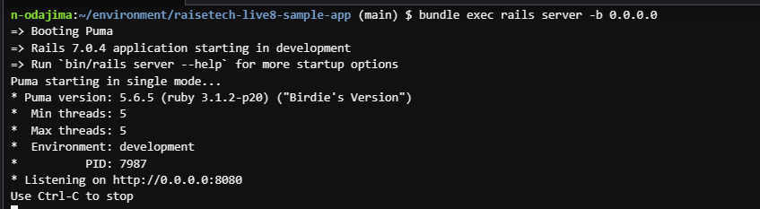
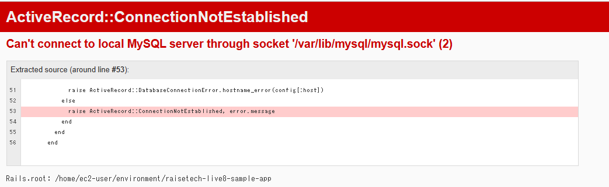

## 第３回課題
* サンプルアプリケーションを今日見せた作業と同じように起動（デプロイ）してみましょう。
* 起動できたら、ブラウザでアクセスしてみましょう。  
    →完了。 
 

* AP サーバーについて調べてみましょう。
  * AP サーバーの名前とバージョンを確認してみましょう。 
  →Puma version 5.6.5  Rails 7.0.4 application
  * AP サーバーを終了させた場合、引き続きアクセスできますか？結果を確認して、
  また AP サーバーを起動してください。  
  →Ctrl＋S で停止するとアクセスできず。

* DB サーバーについて調べてみましょう。
  * サンプルアプリケーションで使った DB サーバー（DB エンジン）の名前と、今 Cloud9 で動作
しているバージョンはいくつか確認してみましょう。  
→ MySQL　version 8.0.32
  * サーバーを終了させた場合、引き続きアクセスできますか？  
→ sudo service mysqld stop にて停止。アクセスできなくなる。 

* Rails の構成管理ツールの名前は何でしたか？確認してみてください。  
→ bundler
* 今回の課題から学んだことを報告してください。  
→ Webアプリケーション立ち上げの流れを学ぶことができた。講義のデモを見ながらコマンドを
  一つ一つ調べながら実施したがやはりつまずきながらとなってしまった。
  デモでもエラーが発生していてググって調べたりしながらやっていたので、
  調べ方なども参考になった。 
  コマンドも画像の貼り付けまで調べて実施することができた。
* （任意）今回の報告を GitHub の PR で行って、URL を報告してください。  
 →第２回の復習も兼ねてやろうとするが、もう忘れてしまっていた。 
  再度講義やノートを見て時間がかかったがなんとかできたと思います。 
 