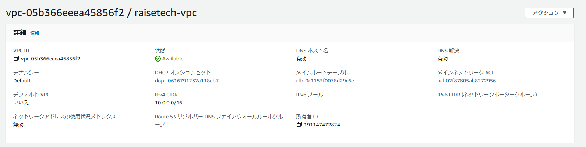
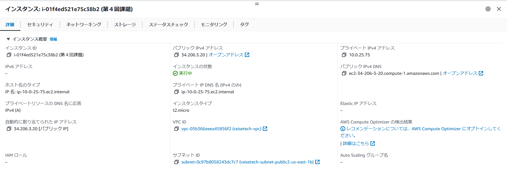
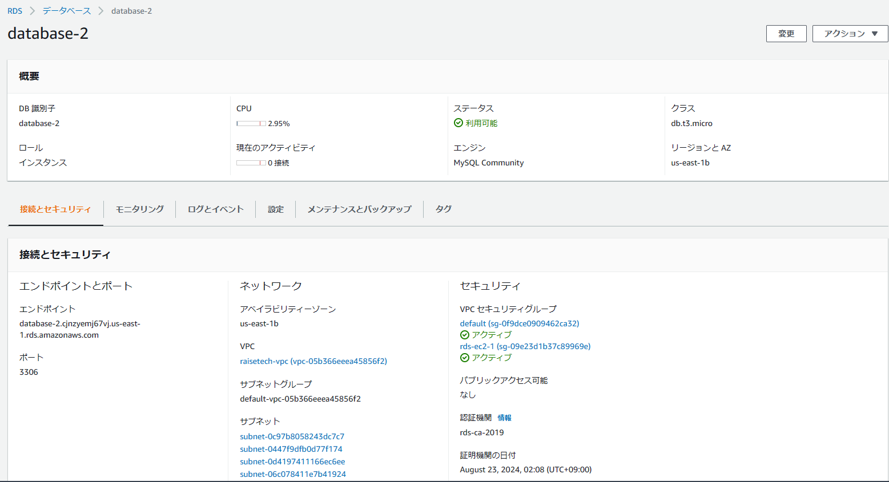
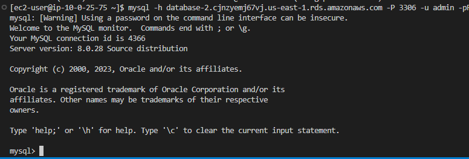

## 第4回課題
* AWS 上に新しく VPC を作ってください。 
 
* EC2 と RDS を構築してください。   
   
    
* EC2 から RDS へ接続をし、正常であることを確認して報告してください。   
   
* 今回の課題からの学び  
VSCodeとEC2との接続に苦戦。コマンドの違いなのか、再度EC2含めて作り直しをしたところようやく接続できた。  
MySQLもインストールにつまずき、接続にも苦戦したがようやく完成できました。  
下記、質問なのですが  
最初、MySQLへの接続を$mysql -u root -pで実施したのですが、どのDBへの接続かが不明と思いやり直しをしました。
これでも正しいのでしょうか？  
